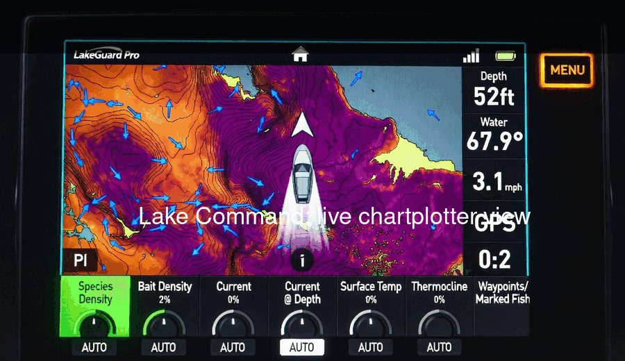
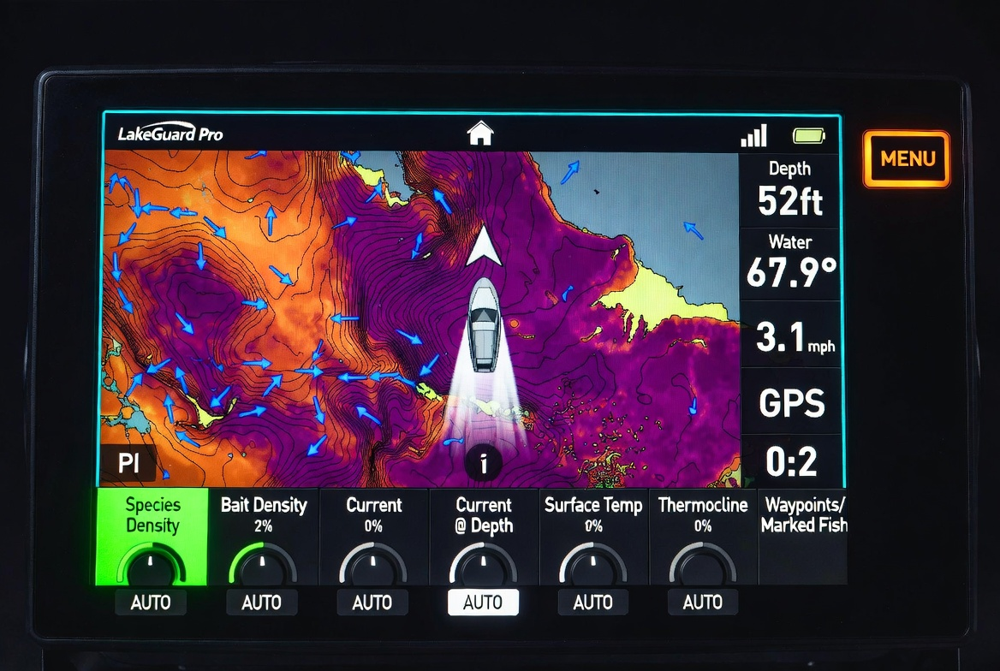
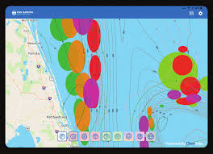
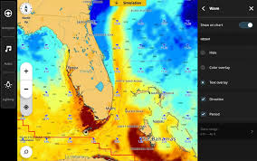
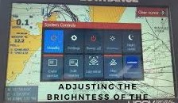

# Lake Command



**AI-Assisted Environmental Intelligence Platform**

[Homepage](index.html) &nbsp; [Demo GIF](docs/assets/lake-command-demo.gif) &nbsp; [GitHub](https://github.com/CapAhabb/Lake-Command-In-Depth) &nbsp; [Roadmap](docs/ROADMAP.md)

---

## Overview

Lake Command is an AI-assisted environmental intelligence platform for turning lake, weather, depth, species, route, and trip signals into a command-center experience. The current prototype focuses on a chartplotter-style interface for Great Lakes fishing intelligence, with dynamic overlays, scenario planning, and a roadmap toward agent-assisted environmental decision support.

The product direction is a practical field tool: fast visual scanning, layered lake intelligence, and clear recommendations that help users understand changing conditions before and during a trip.

---

## Current Development Status

- ✔ Modular Architecture
- ✔ Interactive Mapping
- ✔ AI-assisted development
- 🚧 Faux datasets
- 🚧 Scenario planning
- 🚧 Agent orchestration

---

## Features

- GIS Mapping
- Dynamic Overlays
- Predictive Analytics
- AI Agents
- Scenario Planning
- Environmental Intelligence

---

## Technology Stack

- Next.js
- React
- TypeScript
- Tailwind CSS
- OpenLayers
- GitHub
- AI-assisted Development

Current implementation note: the active prototype in this repository is a Flutter app in `starter_app/`. The stack above represents the target web platform direction for the Lake Command showcase.

---

## Screenshots









---

## Web Showcase

This repository includes a lightweight Vercel-ready homepage at `index.html`. It uses the animated GIF as the first-viewport demo and links directly to the project GitHub repository, roadmap, and demo media.

---

## Roadmap

**Phase 1** - Core chartplotter prototype and visual direction. Complete.

**Phase 2** - Clean up app structure, stabilize UI components, and expand tests. In progress.

**Phase 3** - MVP workflow: select lake, target species, view likely zones, and save trip notes.

**Phase 4** - Replace mock data with reliable environmental data sources and agent-assisted planning.

---

## Run Locally

```bash
cd starter_app
flutter pub get
flutter analyze
flutter test
flutter run
```
